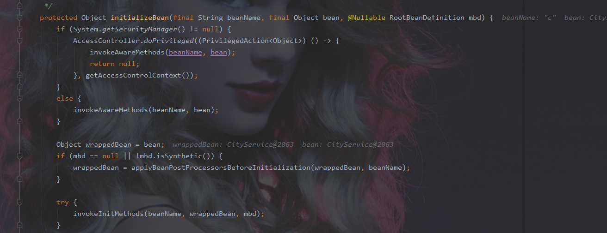

剑指spring 容器javaBean 初始化源码及springAOP {.cjk}
=============================================

首先module的架构

配置类

\

@Configuration\
 @ComponentScan("com.dhcc")\
 @EnableAspectJAutoProxy\
 public class Appconfig {\
 \
 }

一个接口

\

public interface L {\
 public void query();\
 }

接口实现类

\

@Component("c")\
 //@EnableAspectJAutoProxy(proxyTargetClass= true)\
 public class CityService implements L {\
 \
 public CityService() {\
 System.*out*.println("原生电影被拍摄");\
 }\
 @Override\
 public void query() {\
 System.*out*.println("query db ----");\
 }\
 }

aop配置类

\

@Component\
 @Aspect\
 public class dhccAspect {\
 @Pointcut("execution(\* com.dhcc.service..\*.\*(..))")\
 public void pointCut() {\
 }\
 \
 @Before("pointCut()")\
 public void advice(JoinPoint pjp) {\
 System.*out*.println("aop --before--advice");\
 }\
 }

main方法

\

public class test {\
 public static void main(String[] args) {\
 AnnotationConfigApplicationContext ac = new
AnnotationConfigApplicationContext(Appconfig.class);\
 L l = (L) ac.getBean("c");\
 l.query();\
 }\
 \
 }

执行结果

猜测一：

将getBean（）中的参数换位cityservice.class 还能不能获取到呢？

答案是否定的 可以看到cityservice已经初始化成功
但是spring容器中并没有cityservice这个类，这是应为使用了AOP
spring容器中存在的是一个cityservice的动态代理对象。

可以从这里看到

 
 
 

debug跟踪到从spring容器中获取 获取到的是一个动态代理对象

此时 源对象已经初始化。

思考，源对象是从哪里初始化的，又是在什么地方被代理？

想法，spring容器是一个单例池的hashmap singletonObjects 获取对象为

singletonObjects.get，因此 绝对存在一个singletonObjects.put的地方。

idea 全局搜索

进行条件断点debug

发现存入的是一个代理对象，从栈帧中观察

从main方法入口 里面绝对存在初始化源对象并且动态代理的地方。挨个查找

找到一个方法，这个方法的下一步已经是一个代理对象。在这里条件debug

进入getSingleton(beanName, () -\> {

发现再次进入getSingleton(String beanName, ObjectFactory\<?\>
singletonFactory)方法中

此时获取map中的bean对象并未获取到 进入if判断 debug执行

发现这个try里面的语句执行后代理对象已经生成 debug进入

发现进入到前面出现的那个lambda表达式里面的代码

继续进入这个createBean(beanName, mbd, args)方法

继续debug

这句话执行完之后已经是一个代理对象 说明这句代码里面有东西

继续进入doCreateBean(beanName, mbdToUse, args)

继续debug

这句执行完之后 cityservice 初始化完毕

进入

一番操作，

继续进入

发现初始化源对象的语句 继续进入

继续debug

进入

 进入

无参构造方法 源对象初始化完毕。

回到这里 原始bean初始化完毕 继续回到doCreateBean

这句话执行完毕后代理对象出现，debug进入

继续进入

这个方法就是生成aop代理对象的方法 循环中增加了

AnnotationAwareAspectJAutoProxyCreator 这个循环中生成代理对象

题外话 如果在配置类中将aop取消

\

@Configuration\
 @ComponentScan("com.dhcc")\
 //@EnableAspectJAutoProxy\
 public class Appconfig {\
 }

这个方法的循环中将没有这个类

回到方法循环中

等到processor等于AnnotationAwareAspectJAutoProxyCreator这个类 进入

继续进入

生成代理对象

其中

获取所有切面

生成并返回代理对象，一直返回到getSingleton(String beanName,
ObjectFactory\<?\> singletonFactory)方法 这是已经生成代理对象

继续向下 这个方法进入

将代理对象put到spring容器之中 至此 一个代理对象创建完毕

\

\

从源码可以看到 spring容器初始化的时候 会首先getbean 当获取不到
调用getSingleton方法初始化bean
